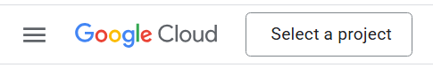
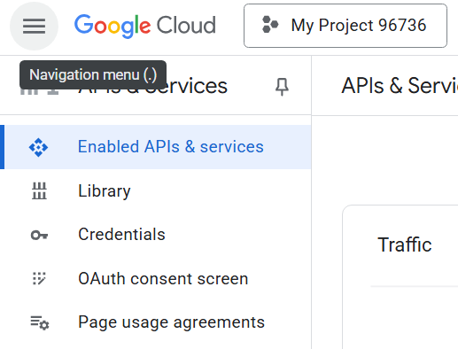
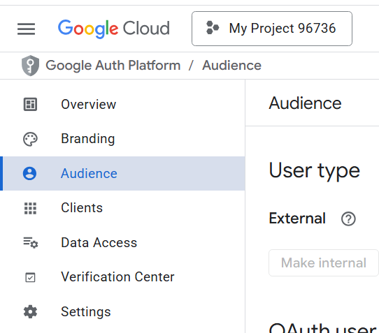

Hosted front-end:

https://clinquant-medovik-161e95.netlify.app/

For testing purpose you can use these accounts:  
`admin1@admin.com`, `staff1@staff.com`, `user1@user.com`  
They all share the same password: `aA1!aaaa`

*Since the project utilizes free services, the server, frontend or database may not be active if they have not been used for a few days

If you want to run the project locally: 

For the purpose of this guide I have picked port 7000 for my server,  3000 for my database
and 5173 for my front-end, but you can choose whichever ports suit you. 

## 1. Create a Google account so that you can use their api services.   
<em><strong>(For this project we will need their calendar api.)</em></strong>
### 1.1 Creating your project.
- After creating the account you need to go to https://console.cloud.google.com
There, on the top left side you will see a button 'Select a project' -> 'New project'  
  
- After giving it a name go to 'Select a project' again and click on your newly created project
- From 'Quick access' go to 'APIs and services'
This will lead you to a page that has this menu  
  
- Go to 'OAuth consent screen'
- Give your app a name, enter your email
- Mark 'External'
- Enter your desired email again and finish

### 1.2 Configuring settings.
#### 1.2.1 Audience.
- Now that you've set up your OAuth you will get a new menu, go to 'Audience'  
  
- Add as many test users as you like so that you may test the app's ability to add events to the Google calendar
#### 1.2.2 Clients.
- From the same menu go to 'Clients' and then 'Create client'
- For 'Application type' pick 'Web application'
- 'Authorized JavaScript origins' can be left empty since logins are handled by better-auth on the server-side
- On 'Authorized redirect URIs' add 'http://localhost:7000/api/auth/callback/google'
- Add the client secret and client ID to the .env file located at back/config/.env
#### 1.2.3 Data Access.
- From the same menu go to 'Data Access' and then 'Add or remove scopes'
- This will open a new menu, click on the 'Google API Library' link
- Search for 'calendar' and then click on 'Google Calendar API' -> 'Enable' 
- Now go back to the same menu from the first step by clicking 'OAuth consent screen' -> 'Data access' -> 'Add or remove scopes'
- Search and add 'calendar.events' and 'userinfo.email'
## 2. Install dependencies by running `npm install` after cloning this repo
## 3. Generate Better-Auth secret.
- Go to https://www.better-auth.com/docs/installation#set-environment-variables
- Click on 'Generate Secret' and save it to your .env file at ./back/config/.env
## 4. Install docker from https://www.docker.com/
## 5. Start the application by using the provided scripts in package.json   for the `/back` and `/front` directories
### 5.1 Edit the `docker-compose.yml` file in `/back` folder
- Change the `POSTGRES_USER`, `POSTGRES_PASSWORD`, `POSTGRES_DB` fields to your liking
### 5.2 Starting the back-end
- Make sure your terminal is running from `./back`
- In order to start the database you first need to launch docker
- Generate the schema by running `npm run migration:generate`
- Run `npm run start:database`
- Run `npm run start:dev`
### 5.3 Starting the front-end
- Make sure your terminal is running from `./front`
- Run `npm run dev`

That's it! There are currently several features that have buttons but are not fully working.  
Those include 'User settings', 'History' and 'Delete account' options in the 'Dashboard' -> 'Profile' menu.  
Once the application is running you will need to manually change one of your users to have a role 'admin'  
in order to access the ability to turn users into 'staff' since their default role is 'user'. In order  
for someone to create events they will need to have their role be either 'staff' or 'admin'. The admin can  
grant that permission by accepting user requests through the dashboard's admin menu. The role can be reverted  
at any point at the admin's discretion.
 
 